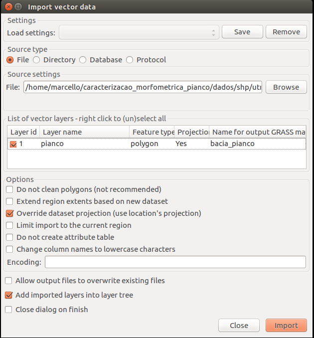
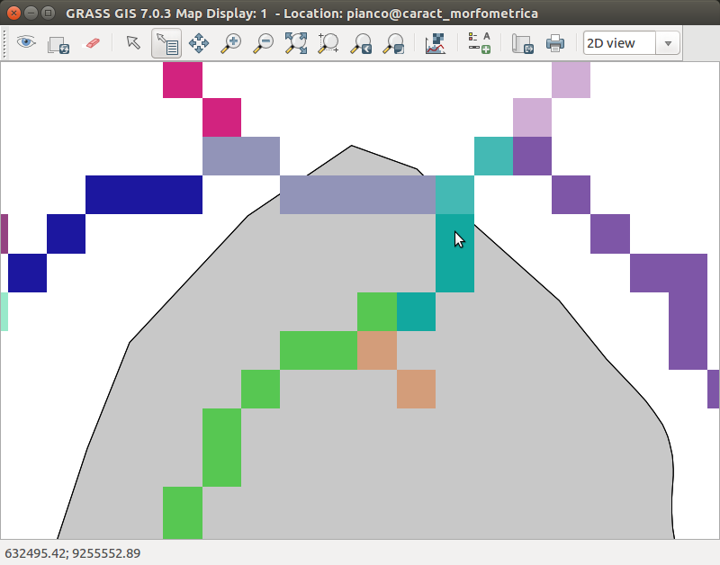
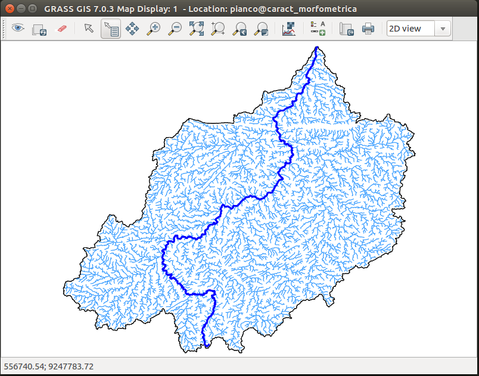

## Realizando a caracterização morfométrica

Para termos uma base do local do exutório da bacia, precisamos importar a camada vetorial que representa a área da bacia, obtida no site da AESA:



Agora é possível localizar visualmente o exutório da bacia:



E extrair o exutório, clicando no botão **Query raster/vector maps**, obtendo então o seguinte resultado:

```
632498.528797, 9255550.25324
```

Configuramos então a region com os dados abaixo:

```
g.region -pa raster=dem.filled align=dem.filled
g.region -p -a res=90 
```

Executamos então o **r.basin** para a caracterização morfométrica:

```
r.basin --o map=dem.filled prefix=pianco coordinates=632498.528797, 9255550.25324 threshold=62 dir=results
```

### Resultados:




#### Classificação da Rede de Drenagem:

```
Output of r.stream.stats: 

Summary:
Max order | Tot.N.str. | Tot.str.len. | Tot.area. | Dr.dens. | Str.freq. 
  (num)   |    (num)   |     (km)     |   (km2)   | (km/km2) | (num/km2) 
        7 |       5369 |    8641.3778 | 9217.8324 |   0.9375 |  0.5825 

Stream ratios based on regression coefficient:
 Bif.rt. | Len.rt. | Area.rt. | Slo.rt. | Grd.rt. 
  4.0793 |  2.0663 |   4.4449 |  1.5935 |  1.8117

Averaged stream ratios with standard deviations:
 Bif.rt. | Len.rt. | Area.rt. | Slo.rt. | Grd.rt. 
  4.0852 |  2.0670 |   3.8536 |  1.6137 |  2.1451
  0.7504 |  0.5086 |   1.8939 |  0.5215 |  1.8585

Order | Avg.len |  Avg.ar  |  Avg.sl |  Avg.grad. | Avg.el.dif
 num  |   (km)  |  (km2)   |  (m/m)  |    (m/m)   |     (m)   
    1 |  0.9907 |   1.3058 |  0.0271 |     0.0215 | 22.2547
    2 |  2.4723 |   6.3112 |  0.0151 |     0.0133 | 33.5148
    3 |  5.9201 |  29.0664 |  0.0101 |     0.0091 | 52.0208
    4 | 13.4943 | 136.9719 |  0.0059 |     0.0048 | 78.4348
    5 | 27.9873 | 599.2955 |  0.0040 |     0.0030 | 92.6000
    6 | 57.9249 | 2754.0081 |  0.0017 |     0.0005 | 40.6667
    7 | 63.0597 | 9217.8324 |  0.0021 |     0.0011 | 67.0000

Order | Std.len |  Std.ar  |  Std.sl |  Std.grad. | Std.el.dif
 num  |   (km)  |  (km2)   |  (m/m)  |    (m/m)   |     (m)   
    1 |  0.8430 |   0.8865 |  0.0290 |     0.0227 | 31.4393
    2 |  2.1843 |   4.3968 |  0.0180 |     0.0143 | 45.4884
    3 |  5.3818 |  20.3090 |  0.0114 |     0.0102 | 63.9862
    4 | 10.8149 |  83.1372 |  0.0052 |     0.0049 | 108.6535
    5 | 16.1787 | 325.1203 |  0.0028 |     0.0023 | 91.4588
    6 | 42.8245 | 1884.2159 |  0.0003 |     0.0005 | 46.9184
    7 | -0.0000 |   0.0000 |  0.0000 |     0.0000 |  0.0000

Order | N.streams | Tot.len (km) | Tot.area (km2)
    1 |      4241 |    4201.5483 | 5538.0996
    2 |       876 |    2165.7346 | 5528.6469
    3 |       192 |    1136.6519 | 5580.7542
    4 |        46 |     620.7357 | 6300.7065
    5 |        10 |     279.8729 | 5992.9551
    6 |         3 |     173.7748 | 8262.0243
    7 |         1 |      63.0597 | 9217.8324

Order | Bif.rt. | Len.rt. | Area.rt. | Slo.rt. | Grd.rt. | d.dens. | str.freq.
    1 |  4.8413 |  2.4955 |   0.0000 |  1.7996 |  1.6167 |  0.7587 |  0.7658
    2 |  4.5625 |  2.3946 |   4.8331 |  1.4977 |  1.4618 |  0.3917 |  0.1584
    3 |  4.1739 |  2.2794 |   4.6055 |  1.7069 |  1.8764 |  0.2037 |  0.0344
    4 |  4.6000 |  2.0740 |   4.7124 |  1.4829 |  1.6252 |  0.0985 |  0.0073
    5 |  3.3333 |  2.0697 |   4.3753 |  2.3995 |  5.8081 |  0.0467 |  0.0017
    6 |  3.0000 |  1.0886 |   4.5954 |  0.7960 |  0.4825 |  0.0210 |  0.0004
    7 |  0.0000 |  0.0000 |   3.3471 |  0.0000 |  0.0000 |  0.0068 |  0.0001

```

#### Obtenção dos Parâmetros Morfométricos:

```
----------------------------------
Morphometric parameters of basin :
----------------------------------
Easting Centroid of basin : 606555.00
Northing Centroid of Basin : 9187875.00
Rectangle containing basin N-W : 531180 , 9255600
Rectangle containing basin S-E : 671400 , 9133470
Area of basin [km^2] : 9217.8293625
Perimeter of basin [km] : 676.832743112
Max Elevation [m s.l.m.] : 1163.0
Min Elevation [m s.l.m.]: 175.0
Elevation Difference [m]: 988.0
Mean Elevation [m s.l.m.]: 445.3229
Mean Slope : 5.25
Length of Directing Vector [km] : 72.4776281865
Prevalent Orientation [degree from north, counterclockwise] : 1.20472243935
Compactness Coefficient : 6.2475820563
Circularity Ratio : 0.252857481272
Topological Diameter : 311.0
Elongation Ratio : 0.451067655398
Shape Factor : 38.3796455205
Concentration Time (Giandotti, 1934) [hr] : 29.5991929601
Length of Mainchannel [km] : 240.174947879
Mean slope of mainchannel [percent] : 0.544928
Mean hillslope length [m] : 7649.11
Magnitudo : 3583.0
Max order (Strahler) : 7
Number of streams : 5369
Total Stream Length [km] : 8641.3778
First order stream frequency : 0.388703224924
Drainage Density [km/km^2] : 0.937463415753
Bifurcation Ratio (Horton) : 4.0793
Length Ratio (Horton) : 2.0663
Area ratio (Horton) : 4.4449
Slope ratio (Horton): 1.5935
------------------------------

```

OBS: Acese a pasta **resultados** para ver todos os arquivos gerados.

Visualizando os resultados no QGIS;


[voltar para a metodologia][0]

[0]:metodologia.md