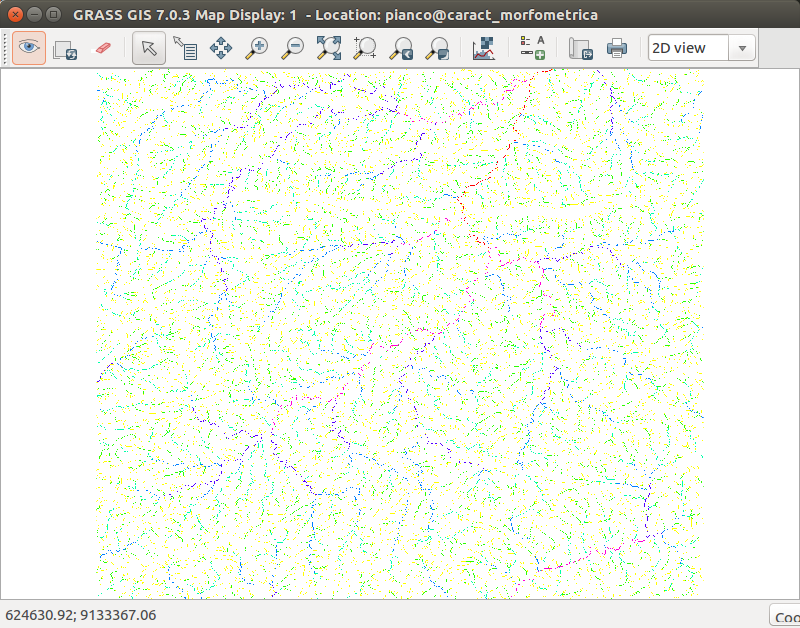
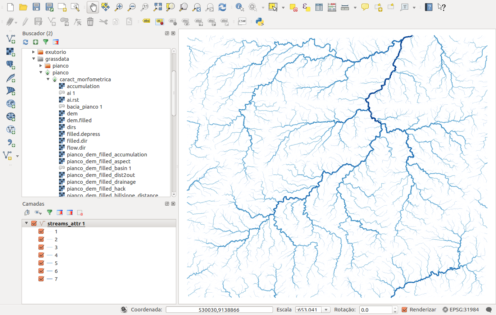

## Extraindo a drenagem classificada.

Com o comando abaixo podemos extrair a rede de drenagem classificada de acordo com vários critérios de classificação hidrológica.

```
r.stream.order --o stream_rast=streams dir=dirs stream_vect=streams_attr strahler=strahler elevation=dem.filled accumulation=accumulation
```




Visualizando o resultado no QGIS:



