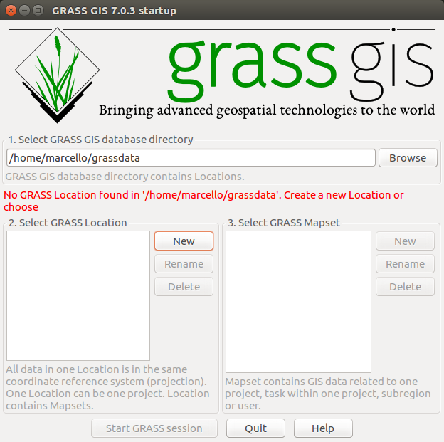
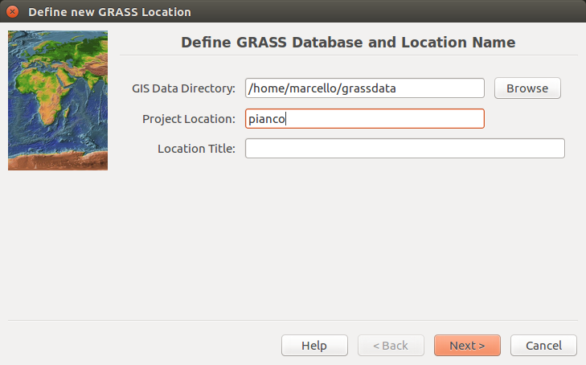
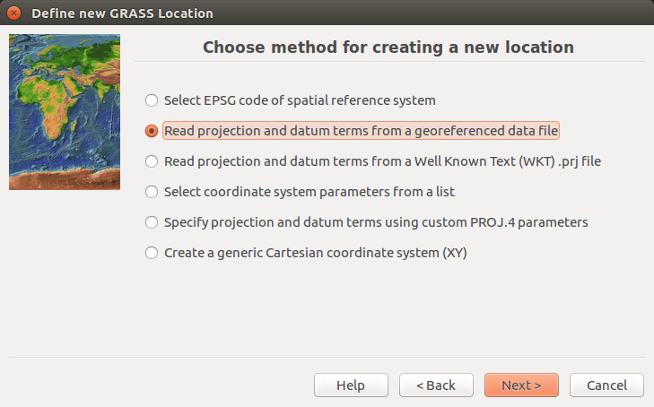
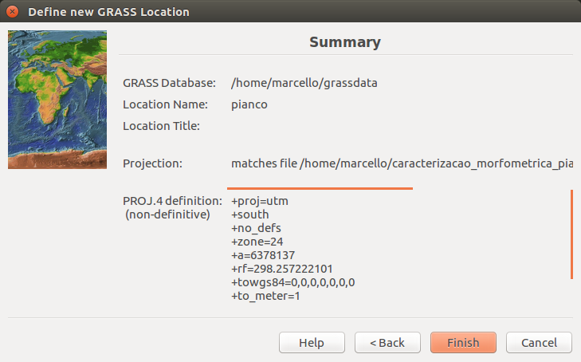
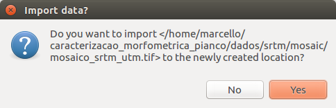
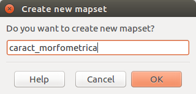
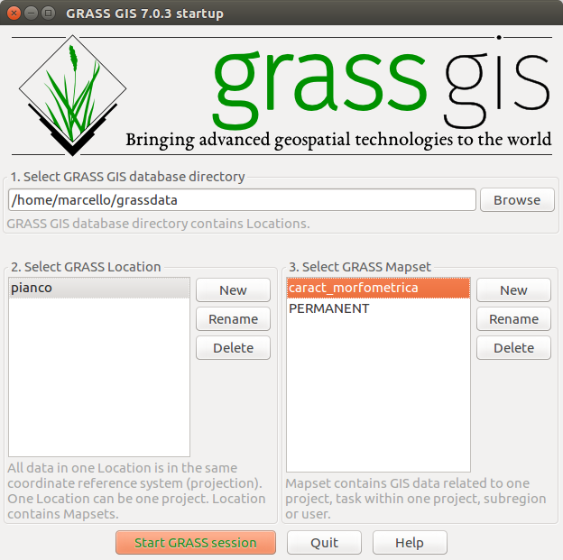

## Configuração da Location e do Mapset

Os dados do GRASS são armazenados em um diretório GISDBASE, este diretório é muitas vezes chamado de grassdata.

Dentro deste diretório (grassdata), os dados do GRASS são organizados por projetos armazenados em subdiretórios chamados LOCATIONs. Cada location é definida por seu sistema de coordenadas, projeção de mapa e fronteiras geográficas.

Cada location pode ter vários MAPSETs (subdiretórios do location) que são usados para subdividir o projeto em diferentes tópicos ou subregiõ̃es, ou como espaços de trabalho para os membros da equipe.

No Terminal, digite **grass**, em seguida, abrirá a janela abaixo:

Nela você deverá criar um diretório com o nome **grassdata**, no diretório **home**. Em seguida, clique em **New** (lado esquerdo, em Select GRASS Location)

Na próxima tela, definimos o nome da **location**:

Em seguida, vamos escolher a segunda opção. Dessa forma o GRASS ira ler a projeção do arquivo raster e definir de forma correta o retâ̂ngulo envolvente e da resolução espacial do nosso projeto a partir do dado SRTM de origem (mosaico_srtm_utm.tif).

Finalize a importação:

**Importante!** escolha YES para a próxima opção para que o GRASS importe o arquivo mosaico_srtm_utm.tif para a location criada.

Defina o nome do mapset:

Por último, inicie o grass através do botão **Start GRASS Session**

[voltar para a metodologia][0]

[0]:metodologia.md
