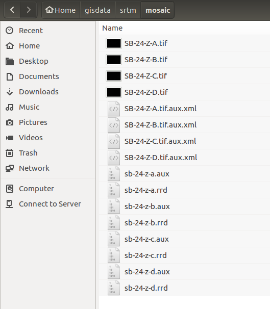

# Caracterização Morfométrica da Bacia do Rio Piancó

## Metodologia

###1 - Criar o mosaico srtm e reprojetar para UTM Fuso 24 Sul (DATUM SIRGAS-2000):

No diretório **mosaic** contendo dos os arquivos SRTM, execute pelo terminal os comandos abaixo:



```bash
# cria o mosaico a partir das imagens:
gdalwarp *.tif mosaico_srtm.tif

#reprojeta para utm:
gdalwarp -s_srs "EPSG:4326" -t_srs "EPSG:31984" mosaico_srtm.tif mosaico_srtm_utm.tif
```