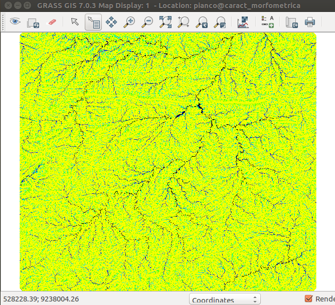
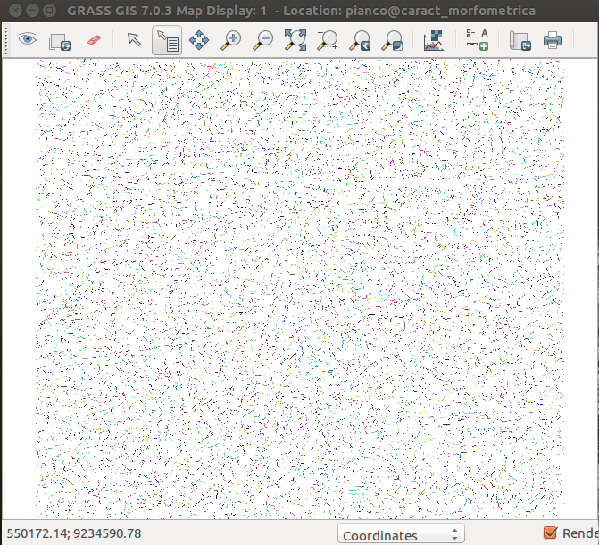

##  Preparando o MDE para a análise morfométrica

Com o comando **r.fill.dir** são removidos os "sinks" (células cercadas por outras com maiores elevações), que produzem a descontinuidade do escoamento superficial descendente para uma célula vizinha.

```
r.fill.dir --o input=dem output=dem.filled direction=filled.dir
```

O próximo passo consiste em criar duas superfícies para análises hidrológicas através do comando r.watershed, são elas: a superfície de fluxo acumulado (accumulation) e a rede de drenagem matricial (streams).

```
r.watershed --o -a elevation=dem.filled threshold=62 accumulation=accumulation stream=streams drainage=dirs
```






OBS: O **threshold** define o tamanho mínimo a ser considerado como uma área de contribuição para a bacia hidrográfica.
Para áreas de 0,5 km2 (500.000 m2) foi utilizado um valor igual a 62  (500.000 / 90x90), onde 90x90 é a resolução espacial da imagem SRTM).


A partir das superfícies criadas acima, é possível relizar a caracterização morfométrica.


[voltar para a metodologia][0]


[0]:metodologia.md