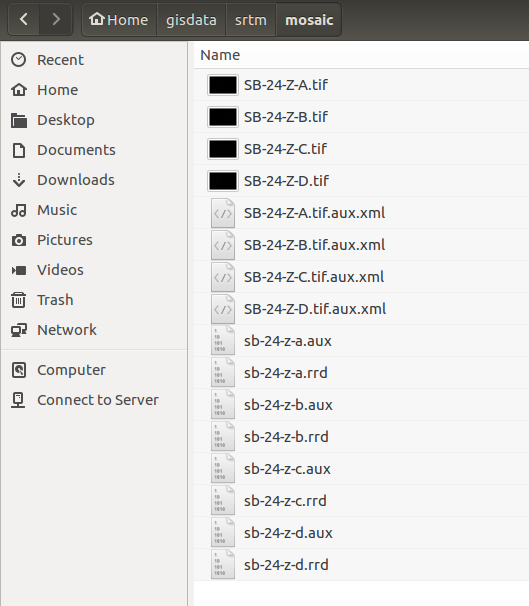

# 1- Processamento inicial dos dados SRTM

### Criar o mosaico srtm e reprojetar para UTM Fuso 24 Sul (DATUM SIRGAS-2000):

Coloque todos os arquivos srtm no diretório **mosaic**:



Execute pelo terminal os comandos abaixo:

```bash
# cria o mosaico a partir das imagens:
gdalwarp *.tif mosaico_srtm.tif

#reprojeta para utm:
gdalwarp -s_srs "EPSG:4326" -t_srs "EPSG:31984" mosaico_srtm.tif mosaico_srtm_utm.tif
```

[voltar para a metodologia][0]

[0]:metodologia.md
